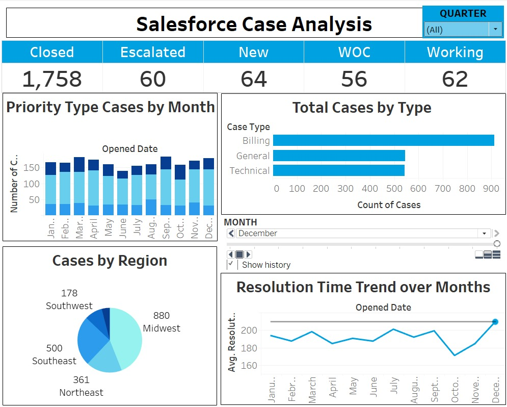

# Salesforce Cases Data Extraction Project

## Overview

This project focuses on extracting Salesforce cases data fields using the Salesforce REST API, transforming the data, and loading it into a PostgreSQL database. The transformed data is then connected to Tableau for visualization and analysis.


## Project Structure

The project is organized as follows:

```plaintext
├── Salesforce-Case-Management-and-Resolution-Metrics
│   ├── RESTAPI              # Directory for REST API-related files
│   ├─── .env                # Environment file to store sensitive cred
│   ├─── extract.py          # Python script to extract Salesforce data using REST API
├── dataset                  # Directory for datasets
│   ├── case_data.csv        # CSV file containing Salesforce case data 
│   └── data.py              
├── logs                     # Directory to store log files
│   └── dbt.log              # Log file generated by dbt during transformations
├── my_dbt_project           # Directory containing the dbt project
│   └── models/example       # Directory for dbt models and configurations
│       ├── final_case.sql   # SQL file for final transformations and output model
│       └── schema.yml       # YAML file to define schema and column-level metadata
│       ├── sources.yml      # YAML file to define source tables and relationships for dbt
│       └── staging_case.sql # SQL file for initial staging transformations
├── VISUALIZATION           # Directory for visualization files
│   └── Salesforce cases Analysis.twbx # Tableau workbook file 
├── README.md                # Project documentation with setup instructions, usage, and overview

```


## Data Fields Extracted

The following Salesforce case data fields are extracted in this project:

- `case_type`
- `priority`
- `Opened_date`
- `Closed_date`
- `customer_satisfaction_score`
- `first_contact_resolution`
- `Customer Region`
- `status`

## Technologies Used

- Python
- Salesforce REST API
- PostgreSQL
- DBT (Data Build Tool)
- Tableau

## Visualization




